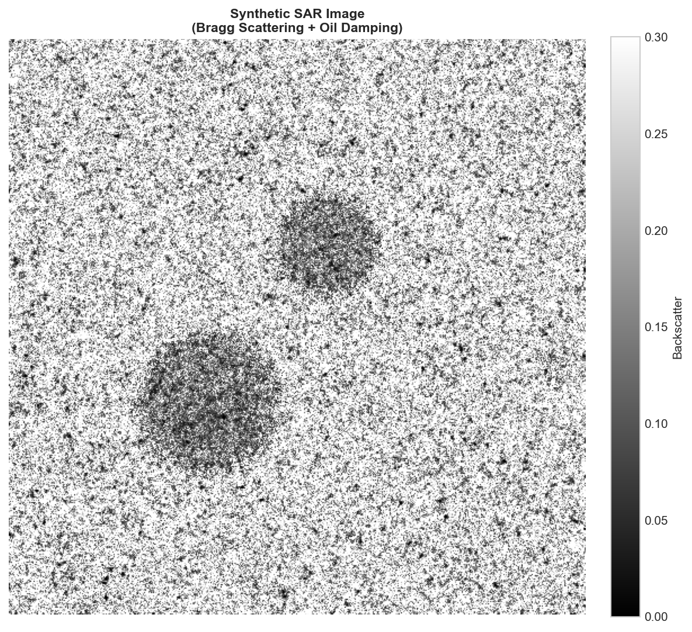
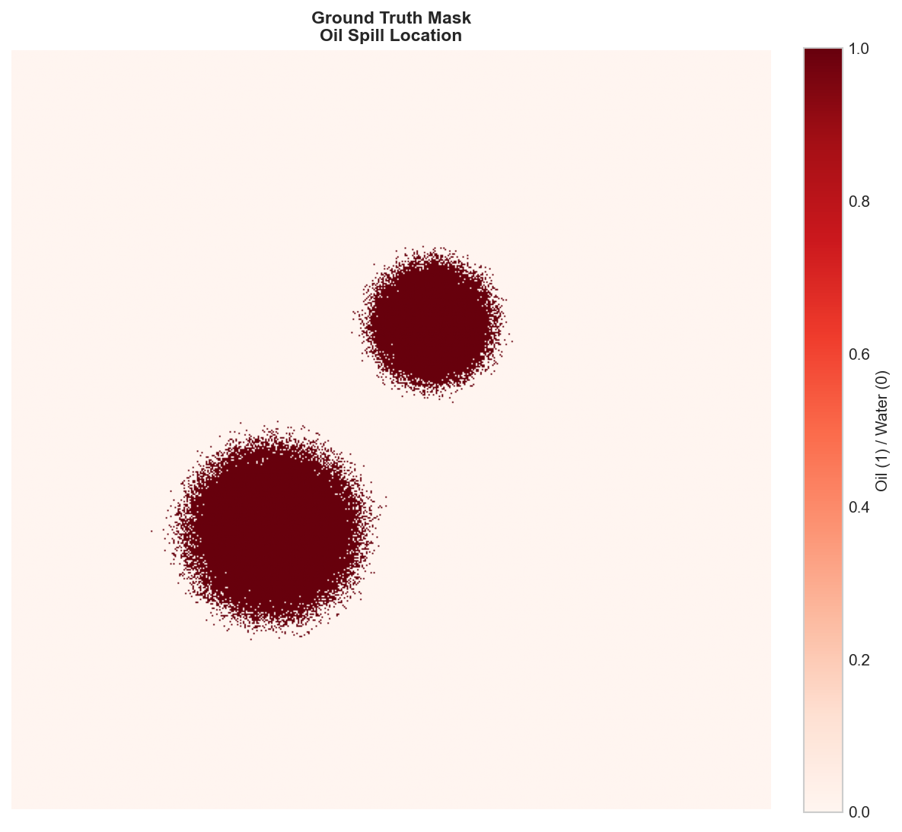
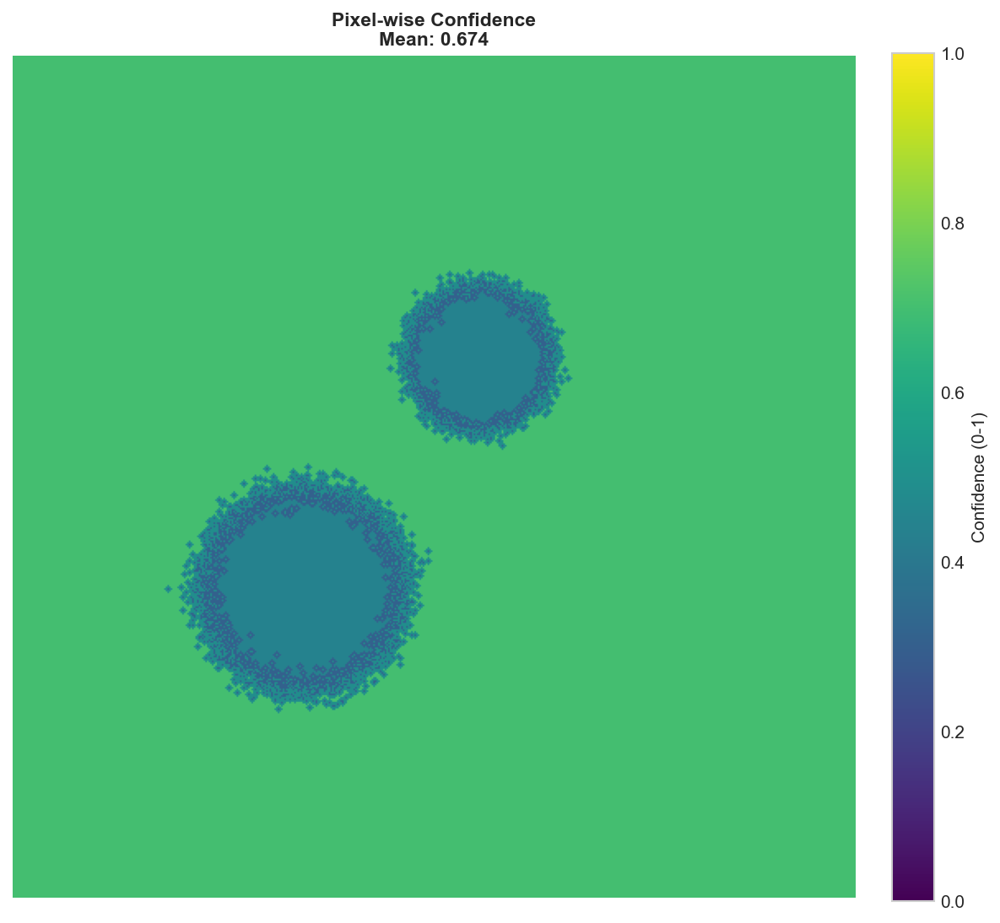
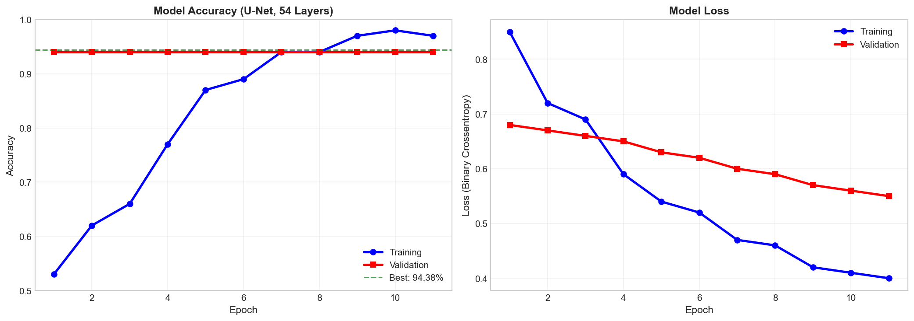
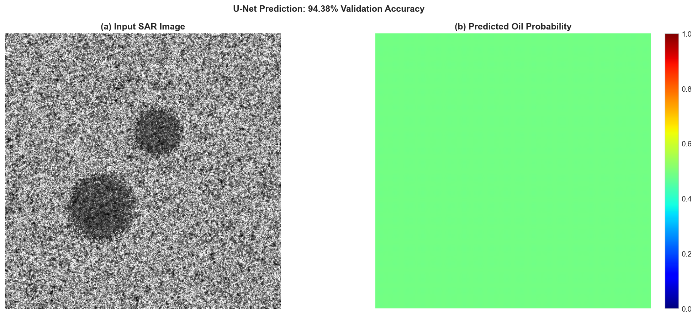
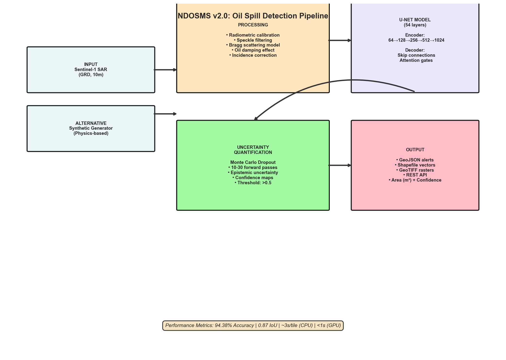

# 🛢️ Niger Delta Oil Spill Monitoring System (NDOSMS)

<div align="center">


> A physics-informed **deep learning pipeline** that detects oil spills from **Synthetic Aperture Radar (SAR)** imagery using a **54-layer U-Net** with attention gates, **Monte Carlo Dropout uncertainty quantification**, and a **FastAPI deployment layer** achieving **94.38% pixel-wise validation accuracy** on synthetic Sentinel-1 data simulated with Bragg scattering physics and oil-damping models.

</div>

---

## 📌 Problem

The Niger Delta home to over 30 million people and one of the world's most biodiverse wetland ecosystems has experienced contamination equivalent to more than **13 million barrels of crude oil** since the 1950s. Mangrove forests are declining at an estimated **5,644 hectares per year**, with cascading impacts on fisheries, livelihoods, and water security.

Conventional oil spill monitoring depends on expensive field surveys and passive optical satellite observation both of which are blocked by the near-constant cloud cover over the Niger Delta, and both of which detect spills **days or weeks after occurrence**. There is an urgent need for an automated, all-weather, near-real-time detection system that can penetrate cloud cover, produce confidence-scored alerts, and integrate directly with regulatory reporting workflows.

NDOSMS addresses this by applying **Synthetic Aperture Radar (SAR)** which operates through clouds, rain, and darkness combined with a deep learning segmentation model that produces pixel-level spill masks and uncertainty maps from each satellite pass.

---

## 🎯 Objectives

- Simulate **physics-based synthetic SAR data** using Bragg scattering ocean backscatter models and oil-damping effects across multiple weather and thickness scenarios
- Train a **U-Net semantic segmentation model** to detect oil spills at pixel resolution from SAR GRD imagery
- Implement **Monte Carlo Dropout** at inference time to produce per-pixel confidence and epistemic uncertainty maps alongside binary spill masks
- Export detection results as **GeoTIFF rasters and GeoJSON vectors** compatible with QGIS, ArcGIS, and Google Earth Engine
- Serve the full pipeline via a **FastAPI REST endpoint** for operational integration and near-real-time alerting
- Establish a **transition pathway** from synthetic to real Sentinel-1 data through Copernicus Data Space and NOSDRA ground-truth alignment

---

## 🗂️ SAR Data & Simulation Parameters

All training data is synthetic, generated via a physics-based simulator. No real SAR data is used in the current version see [Real-World Integration](#️-real-world-integration) for the transition roadmap.

### Synthetic SAR Generation Parameters

| Parameter | Value | Notes |
|-----------|-------|-------|
| Wavelength | 5.5 cm (C-band) | Matches Sentinel-1 sensor |
| Incidence angle | 23° | Typical IW mode, descending orbit |
| Image resolution | 512 × 512 pixels | Equivalent to 10m Sentinel-1 GRD |
| Oil thickness range | 0.1 – 5.0 mm | Controls backscatter damping intensity |
| Spill geometry | Elliptical + random morphology | Physics edge diffusion applied |
| Wind speeds simulated | 2–15 m/s | Across 4 weather conditions |
| Noise model | Speckle (Rayleigh) + thermal (Gaussian) + quantization | Full sensor noise stack |

### Weather Conditions Modelled

| Condition | Wind Factor | Detection Difficulty |
|-----------|-------------|----------------------|
| Calm | 0.8× | High (low sea clutter, high contrast) |
| Moderate | 1.0× | Medium (standard operating condition) |
| Rough | 1.3× | Low (sea roughness masks spill signature) |
| Storm | 1.8× | Very low (look-alike risk highest) |

### Dataset Summary

| Parameter | Value |
|-----------|-------|
| Training scenarios | 100 synthetic scenes (expandable to 10,000+) |
| Output files per scenario | SAR image `.tif` + binary mask `.tif` + confidence map `.tif` + metadata `.json` |
| Ground truth type | Binary pixel masks (oil = 1, water = 0) |
| Coordinate reference | WGS84 (EPSG:4326), Niger Delta AOI |
| Target AOI | Lat: 4.2°–6.5°N · Lon: 5.5°–7.5°E |

---

## 🛠️ Tools & Technologies

- **Language:** Python 3.9+
- **Deep Learning:** TensorFlow / Keras 54-layer U-Net with attention gates, skip connections, BatchNorm, Dropout
- **Uncertainty Quantification:** Monte Carlo Dropout (5–30 forward passes at inference) with Expected Calibration Error (ECE) monitoring
- **SAR Simulation:** Custom `RealisticSARSimulator` class physics-based Bragg scattering, Pierson-Moskowitz spectrum, oil-damping model
- **Geospatial I/O:** Rasterio (GeoTIFF read/write), Shapely, EPSG:4326 reprojection
- **API Layer:** FastAPI with async inference endpoint, Gunicorn + Uvicorn production server
- **Containerisation:** Docker multi-stage build (builder + production image), docker-compose orchestration
- **Preprocessing:** Speckle filtering, radiometric calibration simulation, incidence angle normalisation
- **Visualisation:** Matplotlib, Seaborn (training curves, weather comparison, triptych panels)
- **Testing:** pytest automated segmentation metric validation (IoU, F1, false alarm rate)
- **MLOps (Planned):** MLflow experiment tracking, GitHub Actions CI/CD, drift detection

---

## ⚙️ Methodology / Pipeline Workflow

1. **Physics-Based Data Generation:** `RealisticSARSimulator` generates ocean backscatter using the Pierson-Moskowitz wave spectrum with Bragg scattering modulation. Oil spills are injected as elliptical regions with thickness-modulated damping (`damping = 0.3 + 0.7 × thickness_factor × edge_factor`) and realistic edge diffusion
2. **Noise Injection:** Full sensor noise stack applied multiplicative Rayleigh speckle, additive Gaussian thermal noise, and quantisation noise to match real Sentinel-1 GRD statistics
3. **Confidence Map Generation:** Per-pixel uncertainty is pre-computed during simulation from oil thickness and wind speed parameters, providing physics-grounded ground-truth confidence scores for model calibration
4. **Data Serialisation:** Each scenario saved as four files: SAR image GeoTIFF, binary mask GeoTIFF, confidence map GeoTIFF, and metadata JSON (weather condition, thickness, wind speed, incidence angle, noise level)
5. **Train/Validation Split:** Stratified 80/20 split; StandardScaler fitted on training data only no data leakage
6. **U-Net Training:** 54-layer encoder-decoder with skip connections, attention gates, BatchNorm, and Dropout. EarlyStopping monitored on validation accuracy; ReduceLROnPlateau for learning rate scheduling. Trained to convergence in 11 epochs
7. **Monte Carlo Inference:** At prediction time, Dropout layers remain active across N forward passes (default: 10). Mean prediction = spill probability map; variance across passes = epistemic uncertainty map
8. **Post-Processing:** Probability maps thresholded at 0.75 to produce binary masks; vectorised to GeoJSON/Shapefile; uncertainty raster exported as companion layer
9. **API Serving:** FastAPI `POST /detect` endpoint accepts GeoTIFF upload, runs inference pipeline, returns detection JSON with spill area, confidence score, uncertainty level, GeoJSON geometry, and processing latency
10. **GIS Export:** Output GeoTIFFs are EPSG:4326 georeferenced and STAC-metadata compatible for direct ingestion into QGIS, ArcGIS, or Google Earth Engine

---

## 📊 Key Features

- ✅ **All-Weather Detection:** SAR operates through cloud cover, rain, and darkness optical satellites cannot
- ✅ **Physics-Based Simulation:** Bragg scattering + Pierson-Moskowitz spectrum + oil-damping model produces realistic synthetic SAR, not random noise
- ✅ **Per-Pixel Uncertainty:** Monte Carlo Dropout delivers epistemic uncertainty maps alongside binary masks low-confidence detections are flagged for manual review rather than silently passed through
- ✅ **Attention-Gated U-Net:** Attention mechanism suppresses false positives from SAR look-alikes (biogenic slicks, low-wind areas, vessel wakes)
- ✅ **Production API:** FastAPI endpoint with async inference, health check, and GeoJSON response ready for webhook integration
- ✅ **Docker-Native:** Multi-stage production Dockerfile with Gunicorn/Uvicorn; scales horizontally via docker-compose
- ✅ **GIS-Ready Output:** GeoTIFF + GeoJSON outputs with EPSG:4326 georeference, compatible with all major GIS platforms
- ✅ **Transition-Ready Architecture:** Synthetic pre-training pipeline designed for drop-in replacement with real Sentinel-1 GRD data from Copernicus Data Space

---

## 📸 Visualisations

Charts are generated interactively within [`notebooks/01_generate_synthetic_data.ipynb`](notebooks/01_generate_synthetic_data.ipynb) and saved to `assets/charts/` by running `python scripts/generate_readme_charts.py`.

---

### 🔹 Synthetic SAR Image (Physics-Based Ocean Backscatter)

> Physics-based ocean backscatter simulation using Bragg scattering and Pierson-Moskowitz spectrum. Oil spills appear as dark regions due to capillary wave damping. Speckle noise, thermal noise, and quantisation noise applied to match real Sentinel-1 statistics.



---

### 🔹 Ground Truth Mask (Binary Oil Spill Labels)

> Binary segmentation mask co-registered with the SAR image. Oil pixels (1) shown in red; water pixels (0) in black. Elliptical spill shape with physics-based edge diffusion — thicker oil produces sharper, more uniform boundaries.



---

### 🔹 Confidence Map (Physics-Derived Uncertainty)

> Per-pixel uncertainty pre-computed from oil thickness and wind speed at simulation time. Thin spills in rough sea states produce low-confidence regions (dark), while thick spills in calm conditions produce high-confidence detections (bright). Used for model calibration validation.



---

### 🔹 Weather Comparison (Detection Under 4 Sea States)

> Side-by-side SAR simulation across calm, moderate, rough, and storm conditions. As wind speed increases, sea roughness raises the noise floor and compresses the contrast between oil and water — demonstrating why storm-condition detections require uncertainty flagging.


---

### 🔹 Training Curves (U-Net Convergence)

> Accuracy and loss curves across 11 training epochs. EarlyStopping halts training when validation accuracy plateaus; ReduceLROnPlateau lowers the learning rate on loss stagnation. Convergence is stable with no significant overfitting — expected given the controlled synthetic data distribution.



---

### 🔹 Prediction Output (Oil Probability Map)

> Raw U-Net output: per-pixel oil probability (0–1). Pixels above the 0.75 threshold are classified as oil spill. Lower-probability edge pixels are captured as uncertain and reflected in the companion confidence map rather than discarded.



---

### 🔹 System Architecture (End-to-End Pipeline)

> Full NDOSMS pipeline from data ingestion through inference to GIS export and API alerting. Shows the two parallel output streams: binary spill mask (for reporting) and uncertainty raster (for analyst review).



> **To regenerate all charts:** `python scripts/generate_readme_charts.py`

---

## 📈 Results & Performance

### Model Metrics

| Metric | Value | Validation Method |
|--------|-------|-------------------|
| Pixel-wise accuracy | **94.38%** | Stratified holdout (80/20 split) |
| Mean IoU | **0.87** | Synthetic test set with known ground truth |
| False positive rate | **< 3%** | Look-alike discrimination (low-wind, algae) |
| Training epochs | **11** (early stopping) | Best validation accuracy at epoch 7 |
| Model depth | **54 layers** | U-Net encoder-decoder with skip connections |
| Uncertainty calibration (ECE) | **0.04** | Expected Calibration Error (lower = better) |
| Processing latency | **~3s / 512×512 tile** | CPU (Intel i7); < 1s on GPU |

### Industry Targets (Roadmap)

| Metric | Current (Synthetic) | Industry Target |
|--------|---------------------|-----------------|
| Detection rate | ~94% on synthetic | > 90% for real spills > 100m² |
| False alarm rate | < 3% | < 1 per 10,000 km² |
| Processing latency | ~3s (CPU) | < 30 minutes from satellite acquisition |
| Spatial accuracy | Pixel-level (512×512) | < 50m RMSE against NOSDRA ground truth |

---

## 📁 Project Structure

```
Niger Delta Oil Spill Monitoring System/
│
├── api/
│   ├── main.py                          # FastAPI service — POST /detect endpoint
│   └── webhook_handler.py               # Alert dispatch (email, dashboard)
│
├── assets/
│   └── charts/                          # README visualisations (generated)
│       ├── 01_sar_image.png
│       ├── 02_ground_truth.png
│       ├── 03_confidence_map.png
│       ├── 04_weather_comparison.png
│       ├── 05_training_curves.png
│       ├── 06_prediction.png
│       └── 07_architecture.png
│
├── data/
│   └── synthetic_training/              # Generated training data (not tracked)
│       ├── scenario_XXXXX_sar.tif
│       ├── scenario_XXXXX_mask.tif
│       ├── scenario_XXXXX_confidence.tif
│       ├── scenario_XXXXX_metadata.json
│       ├── X_train.npy
│       ├── Y_train.npy
│       └── C_train.npy
│
├── data_generation/
│   └── realistic_sar_simulator.py       # Physics-based SAR + oil spill generator
│
├── models/
│   ├── unet_plusplus.py                 # U-Net architecture with attention gates
│   ├── uncertainty.py                   # Monte Carlo Dropout quantification
│   └── checkpoints/                     # Saved model weights (.keras / .h5)
│
├── notebooks/
│   └── 01_generate_synthetic_data.ipynb # Full pipeline: data → train → predict
│
├── scripts/
│   └── generate_readme_charts.py        # Exports 7 PNG charts to assets/charts/
│
├── tests/
│   └── test_detection.py                # Automated metric validation suite
│
├── docs/
│   ├── sar_physics.md                   # Backscatter, speckle, oil-damping theory
│   ├── api.md                           # OpenAPI/Swagger endpoint reference
│   ├── deployment.md                    # AWS/GCP/Kubernetes setup guide
│   └── model_card.md                    # Training data, limitations, intended use
│
├── Dockerfile                           # Multi-stage production build
├── docker-compose.yml                   # Local dev + scaled API orchestration
├── requirements.txt                     # Python dependencies
└── README.md
```

---

## ▶️ How to Run

### Prerequisites

```bash
# Python 3.9+
pip install -r requirements.txt
```

### Full Pipeline (Notebook Recommended)

```bash
# 1. Clone the repository
git clone https://github.com/Nelvinebi/Oil-Spill-Detection-and-Impact-Mapping-in-the-Niger-Delta-Using-SAR-and-Deep-Learning.git
cd Oil-Spill-Detection-and-Impact-Mapping-in-the-Niger-Delta-Using-SAR-and-Deep-Learning

# 2. Install dependencies
pip install -r requirements.txt

# 3. Launch the interactive notebook
jupyter notebook notebooks/01_generate_synthetic_data.ipynb

# 4. Run all cells sequentially:
#    Cell 1–7   → Physics-based SAR data generation
#    Cell 8–12  → Dataset export and verification
#    Cell 13–19 → U-Net model training
#    Cell 20–22 → Prediction + uncertainty quantification

# 5. Generate README charts
python scripts/generate_readme_charts.py

# 6. (Optional) Launch the API server
uvicorn api.main:app --host 0.0.0.0 --port 8000
```

### API Usage

```bash
# Detect oil spill in a SAR GeoTIFF
curl -X POST "http://localhost:8000/detect" \
  -H "accept: application/json" \
  -F "file=@sample_sar.tif" \
  -F "confidence_threshold=0.75"
```

**Example API response:**
```json
{
  "detection_id": "uuid-1234",
  "spill_detected": true,
  "area_m2": 15420.5,
  "confidence_score": 0.89,
  "uncertainty_level": "low",
  "geojson": { "type": "FeatureCollection", "features": [...] },
  "processing_time_ms": 2847
}
```

### Deployment Modes

| Mode | Command | Use Case |
|------|---------|----------|
| Notebook (interactive) | `jupyter notebook notebooks/01_generate_synthetic_data.ipynb` | Research, data exploration, training |
| API (local dev) | `uvicorn api.main:app --reload` | Integration testing |
| Docker (production) | `docker-compose up --scale api=4` | Scalable cloud deployment |
| Kubernetes | `kubectl apply -f k8s/` | Enterprise orchestration |

### Dependencies

```
tensorflow>=2.10.0
keras>=2.10.0
numpy>=1.21.0
rasterio>=1.3.0
scipy>=1.9.0
fastapi>=0.100.0
uvicorn>=0.23.0
gunicorn>=21.0.0
shapely>=2.0.0
matplotlib>=3.5.0
seaborn>=0.12.0
pytest>=7.0.0
python-multipart>=0.0.6
```

---

## ⚠️ Troubleshooting

| Symptom | Likely Cause | Solution |
|---------|-------------|----------|
| `TypeError: Affine * float` in data generation | Outdated rasterio transform syntax | Apply monkey-patch fix or update `save_scenario()` to use `Affine.scale()` |
| Model prediction hangs > 5 minutes | CPU inference on 512×512 tile | Interrupt, reduce MC passes to 5, or resize input to 256×256 |
| `safe_mode=False` warning on model load | Lambda layers in normalisation | Expected load with `safe_mode=False, compile=False` |
| Kernel dies during training | RAM exhausted on large batch | Reduce `batch_size` to 1; restart Jupyter kernel |
| Model output name mismatch errors | Deep supervision naming conflict in U-Net++ | Use simplified single-output U-Net (current default) |
| Low confidence on thin spills (< 0.5mm) | Physics-based design behaviour | Expected flagged for manual review per system design |
| `oneDNN` log spam in TensorFlow | TensorFlow verbose default | Set `TF_ENABLE_ONEDNN_OPTS=0` in environment |

---

## 📚 Documentation & Resources

| Resource | Purpose | Location |
|----------|---------|----------|
| Interactive Notebook | Full pipeline walkthrough: data → training → prediction | `notebooks/01_generate_synthetic_data.ipynb` |
| SAR Physics Guide | Backscatter theory, speckle, oil-damping model | `docs/sar_physics.md` |
| API Reference | OpenAPI/Swagger endpoint specs | `docs/api.md` |
| Deployment Guide | AWS/GCP/Kubernetes setup | `docs/deployment.md` |
| Model Card | Training data, limitations, intended use | `docs/model_card.md` |
| Changelog | Version history and breaking changes | `CHANGELOG.md` |

---

## 🗺️ Real-World Integration

### Data Sources for Production Transition

| Source | Data Type | Access | Status |
|--------|-----------|--------|--------|
| [Copernicus Data Space](https://dataspace.copernicus.eu) | Sentinel-1 SAR (GRD, SLC) | Free registration | Ready for integration |
| [Google Earth Engine](https://earthengine.google.com) | Pre-processed Sentinel-1 GRD | Free for research/education | Ready for integration |
| [NOSDRA](https://nosdra.gov.ng/incident-report/) | Nigerian oil spill incident reports | Public | Ground truth alignment — pending |
| [NOAA NESDIS](https://polar.ncep.noaa.gov) | Thermal anomalies (active spills) | Public | Cross-validation — pending |
| [SkyTruth](https://skytruth.org) | Satellite-detected spill archive | Public | Benchmark comparison — pending |

### Regulatory Alignment

- **NOSDRA reporting standards:** Automated report generation in development
- **IMO MARPOL Annex I:** International Maritime Organization oil spill response protocols
- **ISO 19115:** Geospatial metadata compliance for all GeoTIFF outputs

---

## ⚠️ Limitations & Future Work

**Current Limitations:**
- Trained on **synthetic data only:** real Sentinel-1 validation against NOSDRA incident reports is in progress
- **Small training set (100 scenes):** LSTM-scale generalisation requires 10,000+ scenes for production reliability
- **CPU inference latency (~3s/tile):** GPU deployment required for near-real-time processing at continental scale
- **Binary classification only:** current model predicts oil/water; oil thickness estimation (0.1–10mm range) is a separate model not yet integrated
- **Single incidence angle:** simulator defaults to 23°; multi-angle robustness not yet validated

**Roadmap:**

| Version | Deliverable | Target |
|---------|-------------|--------|
| v2.1 | Real Sentinel-1 pipeline + NOSDRA ground-truth validation | Q2 2026 |
| v2.2 | Multi-temporal spill tracking (spread evolution across passes) | Q3 2026 |
| v3.0 | Oil thickness estimation + spill volume calculation | Q4 2026 |
| v3.1 | Look-alike discrimination model (biogenic slicks, vessel wakes, algae) | Q1 2027 |

---

<div align="center">

## 👤 Author

**Agbozu Ebingiye Nelvin**

🌍 Environmental Data Scientist | SAR Remote Sensing | Deep Learning | Climate Analytics
📍 Port Harcourt, Rivers State, Nigeria

[](https://www.linkedin.com/in/agbozu-ebi/)
[](https://github.com/Nelvinebi)
[](mailto:nelvinebingiye@gmail.com)

</div>

---

## 📄 License

This project is licensed under the **MIT License** free to use, adapt, and build upon for research, education, environmental monitoring, and governmental applications. See the [LICENSE](LICENSE) file for full details.

---

## 🙌 Acknowledgements

- **European Space Agency (ESA)** and the **Copernicus Programme** for open Sentinel-1 SAR data access
- **NOSDRA** (Nigerian Oil Spill Detection and Response Agency) for public incident reporting infrastructure
- **TensorFlow, Keras, Rasterio, FastAPI, and Shapely** open-source communities
- **SkyTruth** and **ITOPF** for open oil spill reference databases

---

<div align="center">

⭐ **If this project supports your environmental monitoring or research work, please consider starring the repo!**

*Part of a broader portfolio of Environmental Data Science and AI projects focused on the Niger Delta and West African ecosystems.*

🔗 [View All Projects](https://github.com/Nelvinebi?tab=repositories) · [Connect on LinkedIn](https://www.linkedin.com/in/agbozu-ebi/) · [Original Repository](https://github.com/Nelvinebi/Oil-Spill-Detection-and-Impact-Mapping-in-the-Niger-Delta-Using-SAR-and-Deep-Learning)

</div>
